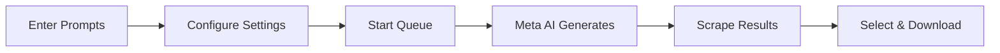

<div align="center">
  
  <h1 align="center">✨ Meta AI Flow — Automator & Downloader</h1>
  <p align="center">
    <strong>Bulk Generate · Smart Scrape · Watermark-Free Download</strong>
  </p>
  <p align="center">
    <a href="https://github.com/mk016/meta-autodownloader">
      
    </a>
    
    
    
    
  </p>
  <br />
</div>

---

## 📋 Table of Contents

- [🌟 Overview](#-overview)
- [✨ Features](#-features)
- [📸 Screenshots](#-screenshots)
- [⚙️ Installation](#️-installation)
- [🚀 Usage Guide](#-usage-guide)
- [🏗️ Architecture](#️-architecture)
- [💬 Message Protocol](#-message-protocol)
- [💾 Storage Schema](#-storage-schema)
- [⚡ Performance & Limits](#-performance--limits)
- [🔒 Security & Permissions](#-security--permissions)
- [🛠️ Development](#️-development)
- [📦 File Structure](#-file-structure)
- [🤝 Contributing](#-contributing)
- [📜 License](#-license)
- [🙏 Acknowledgments](#-acknowledgments)

---

## 🌟 Overview

**Meta AI Flow** is a powerful Chrome extension (Manifest V3) that supercharges your [Meta AI](https://meta.ai) experience. It automates bulk image/video generation from text prompts, scrapes existing media from the page, and downloads everything **watermark-free** using advanced HTML Canvas extraction.

Whether you're a creator generating hundreds of AI images, a researcher collecting visual data, or just someone who wants a seamless download workflow — this tool handles the heavy lifting.

> **Why Canvas extraction?** Direct URL downloads often include server-side watermarks. By drawing images onto an off-screen Canvas element and extracting the raw pixel data, we capture the **original quality** — clean and unmarked.

---

## ✨ Features

### 🎯 Queue Automation

| Feature | Description |
|---------|-------------|
| **Bulk Prompting** | Enter multiple prompts separated by blank lines; process them sequentially |
| **File Import** | Upload `.txt` or `.csv` files, or drag & drop into the prompt zone |
| **Concurrent Processing** | Run 1 or 2 prompts simultaneously (configurable) |
| **Smart Delays** | Random delays between prompts (configurable range, default 20–30s) to avoid rate limiting |
| **Auto-Retry** | Up to 3 retry attempts with 3s delay if communication drops |
| **Queue Controls** | Start, Pause, Stop, Clear with real-time progress bar and status indicators |
| **Prompt Augmentation** | Character descriptions + style prompts + media type + aspect ratio auto-appended |

### 🖼️ Media Scraping

| Feature | Description |
|---------|-------------|
| **Auto-Scroll** | Scrapes up to 50 scroll steps of chat history for older content |
| **Smart Filtering** | Identifies AI resources via CDN URL patterns (`fbcdn.net`, `scontent`, `cdninstagram.com`) |
| **Exclusion Logic** | Automatically filters out profile pictures, avatars, and emoji icons |
| **Gallery View** | 2-column grid with filter pills (All / Images / Videos) |
| **Media Type & Aspect Ratio** | Filter by type (image/video) and ratio (9:16 / 16:9 / 1:1) |

### 🎨 Watermark-Free Download

| Feature | Description |
|---------|-------------|
| **Canvas Extraction** | Draws images onto hidden `<canvas>`, extracts as data URL — bypasses watermarks |
| **Lossless Quality** | Uses natural image dimensions for full-resolution output |
| **Video Support** | Fetches video blobs via `fetch()` → `FileReader` → data URL |
| **Fallback Chain** | Canvas extraction → blob fetch → direct URL download (graceful degradation) |

### 📂 Download Management

| Feature | Description |
|---------|-------------|
| **Sequential Naming** | Auto-names files as `1.png`, `2.png`, `3.png`... using persistent counter |
| **Custom Folder** | Configurable save folder (default: `meta-ai-downloads`) |
| **Download Delay** | Configurable delay between files (default: 500ms) |
| **History Log** | Records each download with timestamp, status, and retry support |
| **Stats Dashboard** | Total Generated · Total Downloaded · Total Failed · Session Count |
| **Export / Import** | Full data export/import as JSON |
| **Reset** | One-click reset all settings and data |

### 🧑‍🎨 Character Consistency Profiles

Save reusable character descriptions that get prepended to every prompt:

```
"Arjun — A 25-year-old Indian man with short curly black hair, warm brown eyes..."
```

- Create, activate (click card), deactivate, delete profiles
- Active profile text auto-prepended to all queue prompts

### 🎭 Style Consistency Profiles

**7 built-in styles** (plus custom):

| Style | Description |
|-------|-------------|
| 🌆 **Cyberpunk Glow** | Neon-drenched futuristic aesthetic |
| 🧸 **3D Pixar** | Soft, stylized Pixar/Disney render |
| 📸 **Photorealistic Cinema** | Ultra-realistic cinematic quality |
| 🌸 **Vibrant Anime** | Bold, saturated anime style |
| 🌑 **Dark Horror** | Moody, terrifying horror visuals |
| 🎨 **2D Animated Painting** | Hand-painted 2D animation look |
| 📖 **2D Horror Storybook** | Dark illustrated storybook style |

- Active style text appended to every queued prompt
- Toggle activation, add custom styles, delete styles

### 👆 On-Page Visual Selection

- **Start Select** — Enter interactive selection mode on the Meta AI page
- **Glassmorphism UI** — Floating banner with count and controls
- **Click to Select** — Click any image/video directly; gets a glowing checkmark badge
- **Two-Way Sync** — Sidepanel checkboxes and on-page badges stay in sync
- **Persists Across Scroll** — Continuous scanning keeps selection alive

### 🎛️ Side Panel UI

| Feature | Description |
|---------|-------------|
| **5 Tabs** | Queue · Scraper · History · Profiles · Settings |
| **Theme Toggle** | Dark/Light with persisting preference |
| **Glassmorphism Design** | Frosted glass panels with neon accents |
| **Toast Notifications** | Success / Error / Info / Warning |
| **Preview Modal** | Click to preview image/video with download button |
| **Keyboard Shortcuts** | `Ctrl+D` (Download All) · `Ctrl+S` (Scan) · `Ctrl+Enter` (Start Queue) · `Esc` (Close Preview) |

---

## 📸 Screenshots

<!-- Add screenshots here -->
| Tab | Description |
|-----|-------------|
| **Queue** | Bulk prompts with start/pause/clear, progress bar, live status |
| **Scraper** | Auto-scanned gallery with filters, select-all, batch download |
| **History** | Download log with timestamps, retry, stats dashboard |
| **Profiles** | Character & style profile cards with activate/deactivate |
| **Settings** | Delays, naming, folders, theme, export/import, reset |
| **On-Page** | Floating glassmorphism selection banner with checkmark badges |

---

## ⚙️ Installation

### Prerequisites

- [Google Chrome](https://www.google.com/chrome/) (latest version)
- A [Meta AI](https://meta.ai) account (sign in required)

### Steps

```bash
# 1. Clone the repository
git clone https://github.com/mk016/meta-autodownloader.git

# 2. Navigate into the directory
cd meta-autodownloader
```

```bash
# 3. (Optional) Install dependencies — only used by npm for metadata
npm install
```

> ⚠️ **No build step required!** This is raw JavaScript — no Webpack, Vite, TypeScript, or transpilation needed.

### Load in Chrome

1. Open Chrome and go to `chrome://extensions/`
2. Enable **Developer mode** (toggle top-right)
3. Click **Load unpacked**
4. Select the project folder
5. ✅ Extension icon appears in the toolbar

---

## 🚀 Usage Guide

### First Run

1. Navigate to `https://www.meta.ai` and **sign in**
2. Click the extension icon in the toolbar → Side Panel opens on the right
3. Go to **Settings** tab to configure delays, folder name, media type, etc.

### Generating Images/Video



1. **Queue Tab** — Type prompts (one per line, blank line = separator)
2. Or **drag & drop** a `.txt` / `.csv` file
3. Click **Start Queue** → watch progress bar fill
4. Switch to **Scraper Tab** → click **Scan Page**
5. Select items → click **Download Selected**

### Pro Tips

- 💡 Use **Character Profiles** for character consistency across generations
- 🎨 Use **Style Profiles** to maintain visual aesthetic across prompts
- ⏱️ Set delays to 30–60s for safer rate limiting on heavy usage
- 📂 Export your data regularly from Settings as JSON backup
- ⌨️ Master the keyboard shortcuts for speed

---

## 🏗️ Architecture

### Extension Architecture (Manifest V3)

```
┌─────────────────────────────────────────────────────────────┐
│                     background.js                           │
│                  Service Worker (621 lines)                  │
│  ┌───────────────────────────────────────────────────────┐  │
│  │  Queue Manager     │  Download Handler                │  │
│  │  ├─ processNext    │  ├─ downloadMedia                │  │
│  │  ├─ advanceQueue   │  ├─ downloadDataURL              │  │
│  │  ├─ pause/stop     │  └─ downloadFromURL              │  │
│  │  └─ retry logic    │                                   │  │
│  ├───────────────────────────────────────────────────────┤  │
│  │  Storage Manager   │  Stats & History                 │  │
│  │  ├─ init defaults  │  ├─ stats                        │  │
│  │  ├─ migrations     │  ├─ history                      │  │
│  │  └─ CRUD helpers   │  └─ export/import                │  │
│  └───────────────────────────────────────────────────────┘  │
└──────────────────────────┬──────────────────────────────────┘
                           │ chrome.runtime / tabs messaging
            ┌──────────────┼──────────────────────┐
            ▼              ▼                      ▼
┌──────────────────┐ ┌──────────────┐ ┌──────────────────────┐
│   sidepanel.js   │ │  content.js  │ │   Meta AI Web Page   │
│   (1927 lines)   │ │  (1129 ln)   │ │   (host page)        │
│                  │ │              │ │                       │
│  UI Controller   │ │ Prompt Exec  │ │ AI generation happens │
│  Tab Manager     │ │ Canvas Extr. │ │ here                  │
│  Gallery View    │ │ Scroll Scrape│ │                       │
│  Preview Modal   │ │ On-Page Sel. │ │                       │
│  Toast System    │ │ CSS Inject   │ │                       │
└──────────────────┘ └──────────────┘ └──────────────────────┘
```

### Communication Flow

| Path | Mechanism |
|------|-----------|
| `sidepanel.js` ↔ `background.js` | `chrome.runtime.sendMessage` / `onMessage` |
| `background.js` ↔ `content.js` | `chrome.tabs.sendMessage` / `onMessage` |
| `sidepanel.js` ↔ `content.js` | `chrome.tabs.sendMessage` (via active tab query) |
| `content.js` → `background.js` | `chrome.runtime.sendMessage` (completion/failure events) |
| **Persistence** | `chrome.storage.local` (5MB quota) |

### Design Patterns

| Pattern | Usage |
|---------|-------|
| **Mediator** | Background service worker mediates between side panel and content script |
| **Observer** | `chrome.storage.onChanged` listener reactively updates UI |
| **Queue / Pipeline** | Sequential prompt processing with configurable delays |
| **Polling** | Content script polls every 1.5s for new generated media |
| **Fallback Chain** | Canvas extraction → blob fetch → direct URL download |
| **Retry** | 3 retries with delay before skipping a prompt |
| **Migration** | Data migrations on install/startup to inject new defaults |

---

## 💬 Message Protocol

### Content Script Actions

| Action | Direction | Purpose |
|--------|-----------|---------|
| `PING` | → content | Check if content script is alive |
| `EXECUTE_PROMPT` | → content | Send prompt to Meta AI input |
| `PROMPT_COMPLETED` | ← content | Generation succeeded with URLs |
| `PROMPT_FAILED` | ← content | Generation failed |
| `SCRAPE_PAGE` | → content | Scrape all media from page |
| `AUTO_SCROLL_SCRAPE` | → content | Auto-scroll then scrape |
| `DOWNLOAD_VIA_HTML` | → content | Canvas-extract an image |
| `DOWNLOAD_VIDEO_HTML` | → content | Blob-fetch a video |
| `START_SELECTION_MODE` | → content | Start on-page visual selection |
| `STOP_SELECTION_MODE` | → content | Stop on-page visual selection |
| `SYNC_SELECTION_FROM_SIDEPANEL` | → content | Sync checkbox selection to page |
| `ON_PAGE_SELECTION_CHANGED` | ← content | Page selection updated |
| `ON_PAGE_SELECTION_STOPPED` | ← content | Selection mode ended |
| `DOWNLOAD_ON_PAGE_ITEMS` | ← content | Trigger download of page-selected items |

### Background Actions

| Action | Direction | Purpose |
|--------|-----------|---------|
| `START_QUEUE` | → background | Begin processing prompt queue |
| `PAUSE_QUEUE` | → background | Pause queue processing |
| `STOP_QUEUE` | → background | Stop and clear queue |
| `DOWNLOAD_MEDIA` | → background | Download file by URL |
| `DOWNLOAD_MEDIA_DATAURL` | → background | Download from data URL |
| `DOWNLOAD_PENDING_SELECTED` | → background | Download selected gallery items |
| `GET_STATS` | → background | Fetch download statistics |
| `CLEAR_HISTORY` | → background | Clear download history |
| `RETRY_DOWNLOAD` | → background | Retry failed download |
| `RESET_DOWNLOAD_COUNTER` | → background | Reset sequential naming counter |
| `CLEAR_PENDING_MEDIA` | → background | Clear generated gallery |

---

## 💾 Storage Schema

All data is persisted in `chrome.storage.local`.

| Key | Type | Default | Description |
|-----|------|---------|-------------|
| `queue` | `string[]` | `[]` | Array of prompt strings |
| `currentIndex` | `number` | `0` | Current queue processing position |
| `status` | `"idle"` | `"running"` | `"paused"` | `"idle"` | Queue state machine |
| `statusMessage` | `string` | `""` | Human-readable status |
| `settings` | `object` | *(see below)* | User configuration |
| `characters` | `object[]` | `[]` | Saved character profiles |
| `activeCharacterId` | `string` | `"none"` | Active character profile ID |
| `styles` | `object[]` | 7 defaults | Style profiles (prompt suffixes) |
| `activeStyleId` | `string` | `"none"` | Active style profile ID |
| `downloadCounter` | `number` | `0` | Incremental naming counter |
| `downloadHistory` | `object[]` | `[]` | Download records (max 200) |
| `stats` | `object` | `{totalGenerated:0, totalDownloaded:0, totalFailed:0, sessionDownloaded:0}` | Usage statistics |
| `theme` | `"dark"` | `"light"` | `"dark"` | UI theme preference |
| `pendingMedia` | `object[]` | `[]` | Recently generated media |

### Default Settings Object

```json
{
  "minDelay": 20,
  "maxDelay": 30,
  "folderName": "meta-ai-downloads",
  "outputsPerPrompt": 1,
  "autoRename": true,
  "concurrentPrompts": 1,
  "mediaType": "both",
  "useCanvasDownload": true,
  "sequentialNaming": true,
  "downloadDelay": 500,
  "aspectRatio": "9:16"
}
```

---

## ⚡ Performance & Limits

| Metric | Value |
|--------|-------|
| **Polling Interval** | 1.5s (content script checks for new media) |
| **Max Scroll Steps** | 50 (auto-scrape depth) |
| **Max History Entries** | 200 (download history) |
| **Storage Quota** | 5MB (`chrome.storage.local` limit) |
| **Retry Attempts** | 3 (with 3s delay between) |
| **Concurrent Prompts** | 1 or 2 (configurable) |
| **Prompt Timeout** | 45s (fallback to partial results) |

---

## 🔒 Security & Permissions

### Requested Permissions

| Permission | Reason |
|------------|--------|
| `downloads` | Save files to user's Downloads folder |
| `storage` | Persist queue, settings, profiles, history |
| `sidePanel` | Open Chrome Side Panel UI |
| `activeTab` | Interact with the active Meta AI tab |
| `scripting` | Dynamically inject content script if needed |
| `tabs` | Query and communicate with Meta AI tabs |

### Host Permissions

- `https://*.meta.ai/*` — Scoped exclusively to Meta AI domains

### Security Notes

- On-page selection mode injects CSS with `!important` rules only while **explicitly activated** by the user
- No data is sent to external servers — everything runs locally in your browser
- No tracking, analytics, or telemetry
- The extension cannot read your browsing history or other websites

---

## 🛠️ Development

### No Build Step

This is a **zero-build-tooling** project. All files are raw JavaScript, HTML, and CSS. Edit and reload.

### Hot Reload Workflow

1. Make your changes to `.js`, `.html`, or `.css` files
2. Go to `chrome://extensions/`
3. Click the **↻ Refresh** icon on the extension card
4. Or use an [extension reloader](https://chromewebstore.google.com/detail/extensions-reloader/fimgfedafeadlieiabdeeaahjajkibhk)

### Adding a New Feature

1. Add message handler in `background.js` if persistent logic is needed
2. Add listener in `content.js` if page interaction is required
3. Add UI in `sidepanel.html` + logic in `sidepanel.js`
4. Add styles in `sidepanel.css`
5. Register new message types in both sender and receiver

### Code Conventions

- ES6+ JavaScript (no transpilation)
- `chrome.storage.local` for all persistence
- `chrome.runtime.sendMessage` / `chrome.tabs.sendMessage` for cross-context communication
- CSS custom properties for theming (`--bg-primary`, `--text-primary`, etc.)
- Toast system for user feedback
- Centralized storage key constants to avoid typos

---

## 📦 File Structure

```
meta-ai-downloader/
├── 📄 manifest.json              # Extension configuration (Manifest V3)
├── 📄 background.js              # Service worker — queue, download, storage (621 lines)
├── 📄 content.js                 # Content script — prompt exec, scraping, canvas (1129 lines)
├── 📄 sidepanel.html             # Side panel HTML — 5-tab UI (541 lines)
├── 📄 sidepanel.js               # Side panel logic — UI controllers (1927 lines)
├── 📄 sidepanel.css              # Styles — glassmorphism, themes, animations (1745 lines)
├── 📄 package.json               # npm metadata (no scripts, 2 accidental deps)
├── 📄 package-lock.json          # npm lockfile
│
├── 🖼️ icons/
│   ├── icon16.png                # Toolbar icon (16×16)
│   ├── icon48.png                # Extensions page icon (48×48)
│   └── icon128.png               # Store icon (128×128)
│
└── 📁 node_modules/              # Installed deps (unused in extension code)
```

---

## 🤝 Contributing

Contributions are welcome! Here's how to help:

1. **Fork** the repository
2. **Create a feature branch**: `git checkout -b feat/amazing-feature`
3. **Make your changes** (remember — no build step, raw JS)
4. **Test manually** by reloading the unpacked extension
5. **Commit** with a clear message
6. **Push** and open a **Pull Request**

### Ideas for Contribution

- Add batch download with zip packaging (JSZip)
- Implement download queue with parallel/serial mode
- Add more built-in style profiles
- Improve CSS animations and transitions
- Add unit or E2E tests
- Internationalization (i18n) support
- Migration to TypeScript (optional)

---

## 📜 License

Distributed under the **MIT License**. See `LICENSE` for more information.

```
MIT License

Copyright (c) 2024 mk016

Permission is hereby granted, free of charge, to any person obtaining a copy
of this software and associated documentation files (the "Software"), to deal
in the Software without restriction, including without limitation the rights
to use, copy, modify, merge, publish, distribute, sublicense, and/or sell
copies of the Software...
```

---

## 🙏 Acknowledgments

- **[Meta AI](https://meta.ai)** — For the incredible generative AI platform
- **Chrome Extensions Documentation** — For the Manifest V3 APIs
- **Open Source Community** — For inspiration and patterns

---

<div align="center">
  <sub>Built with ❤️ for the AI creator community</sub>
  <br />
  <sub>
    <a href="https://github.com/mk016/meta-autodownloader/issues">Report Bug</a> ·
    <a href="https://github.com/mk016/meta-autodownloader/issues">Request Feature</a>
  </sub>
</div>
